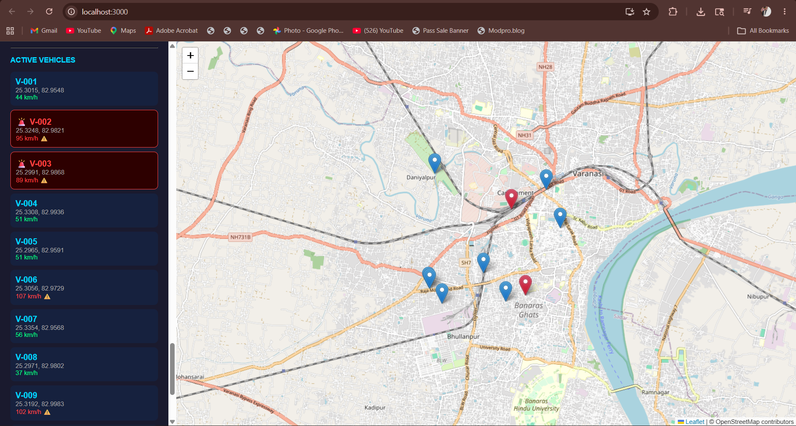

# 🚛 FleetPulse — Real-Time Fleet Tracking & Dispatch Platform

A production-grade real-time fleet tracking system built with microservices architecture, simulating logistics operations at scale (Amazon, Zomato, Dunzo level).

## 📸 Dashboard Screenshot



## 🎯 What It Does

FleetPulse is a control room dashboard where dispatchers can:
- **Track vehicles in real time** on a live map
- **Find the nearest driver** to any pickup location instantly
- **Receive live alerts** when vehicles go idle or deviate from routes
- **Assign orders** to drivers automatically

## 🏗️ Architecture

Vehicle GPS Ping (every 5s)
↓
Location Service (Port 8082)
↓              ↓              ↓
MongoDB         Redis          Kafka
(History)     (GeoSpatial)    (Events)
↓
WebSocket Service (Port 8083)
↓
React Dashboard (Port 3000)

## ⚙️ Tech Stack

| Layer | Technology |
|-------|-----------|
| Backend Services | Spring Boot 3.5, Java 21 |
| Authentication | Spring Security + JWT |
| Message Broker | Apache Kafka |
| Geospatial Cache | Redis GeoSpatial (GEOADD/GEORADIUS) |
| Location History | MongoDB |
| User/Order Data | PostgreSQL |
| Real-time Push | Spring WebSocket + STOMP |
| Frontend | React.js + Leaflet.js |
| Infrastructure | Docker + Docker Compose |

## 🚀 Microservices

### Auth Service (Port 8081)
- JWT-based authentication
- Role-based access control (Driver, Dispatcher, Manager)
- BCrypt password encryption

### Location Service (Port 8082)
- GPS ping ingestion endpoint
- Redis GeoSpatial storage for real-time vehicle positions
- MongoDB persistence for full location history
- Kafka event publishing
- Nearest driver dispatch via GEORADIUS

### WebSocket Service (Port 8083)
- Kafka consumer for vehicle.location topic
- Real-time push to dispatcher dashboard via STOMP
- Live map updates without polling

## 🔑 Key Technical Highlights

**Redis GeoSpatial Dispatch**
Finding the nearest driver is a single Redis command:
```java
redisTemplate.opsForGeo().radius(
    "fleet:vehicles",
    new Circle(new Point(lng, lat),
    new Distance(5, Metrics.KILOMETERS))
);
```
Returns nearest vehicle in under 5ms — no SQL joins, no external APIs.

**Event-Driven GPS Pipeline**
GPS Ping → Kafka Topic (vehicle.location) → WebSocket Service → Browser

Kafka decouples services — if WebSocket service goes down, no GPS data is lost.

**Polyglot Persistence**
- PostgreSQL → Users, roles, orders (relational)
- MongoDB → Location history (document)
- Redis → Real-time geospatial state (in-memory)

## 🛠️ Running Locally

### Prerequisites
- Java 21+
- Maven 3.9+
- Docker Desktop
- Node.js 18+

### Step 1 — Start Infrastructure
```bash
docker compose up -d
```
Starts: PostgreSQL, MongoDB, Redis, Kafka, Zookeeper

### Step 2 — Start Auth Service
```bash
cd backend/auth-service
mvn spring-boot:run
```

### Step 3 — Start Location Service
```bash
cd backend/location-service
mvn spring-boot:run
```

### Step 4 — Start WebSocket Service
```bash
cd backend/websocket-service
mvn spring-boot:run
```

### Step 5 — Start Frontend
```bash
cd frontend
npm start
```

Open **http://localhost:3000** to see the live map.

## 📡 API Endpoints

### Auth Service
| Method | Endpoint | Description |
|--------|----------|-------------|
| POST | /api/auth/register | Register new user |
| POST | /api/auth/login | Login and get JWT token |
| GET | /api/auth/health | Health check |

### Location Service
| Method | Endpoint | Description |
|--------|----------|-------------|
| POST | /api/location/ping | Receive GPS ping from vehicle |
| GET | /api/location/history/{vehicleId} | Get vehicle location history |
| GET | /api/location/nearby?lat=&lng=&radius= | Find nearby vehicles |
| GET | /api/dispatch/nearest?lat=&lng= | Find nearest driver |

## 📁 Project Structure
FleetPulse/
├── docker-compose.yml
├── backend/
│   ├── auth-service/
│   ├── location-service/
│   └── websocket-service/
└── frontend/
└── src/
└── App.js

## 🔮 Roadmap

- [ ] Kafka Streams idle vehicle detection
- [ ] Route deviation alerts
- [ ] Order lifecycle management
- [ ] GitHub Actions CI/CD pipeline
- [ ] Kubernetes deployment

## 👤 Author

**Satyam** — [GitHub](https://github.com/Satyam-here15)
